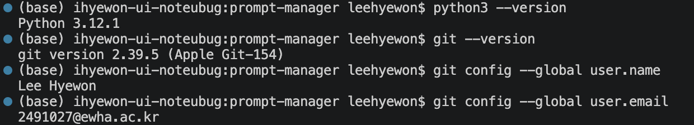
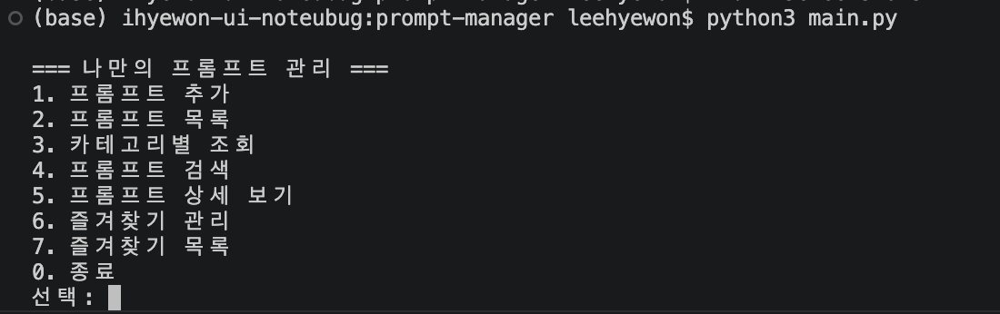
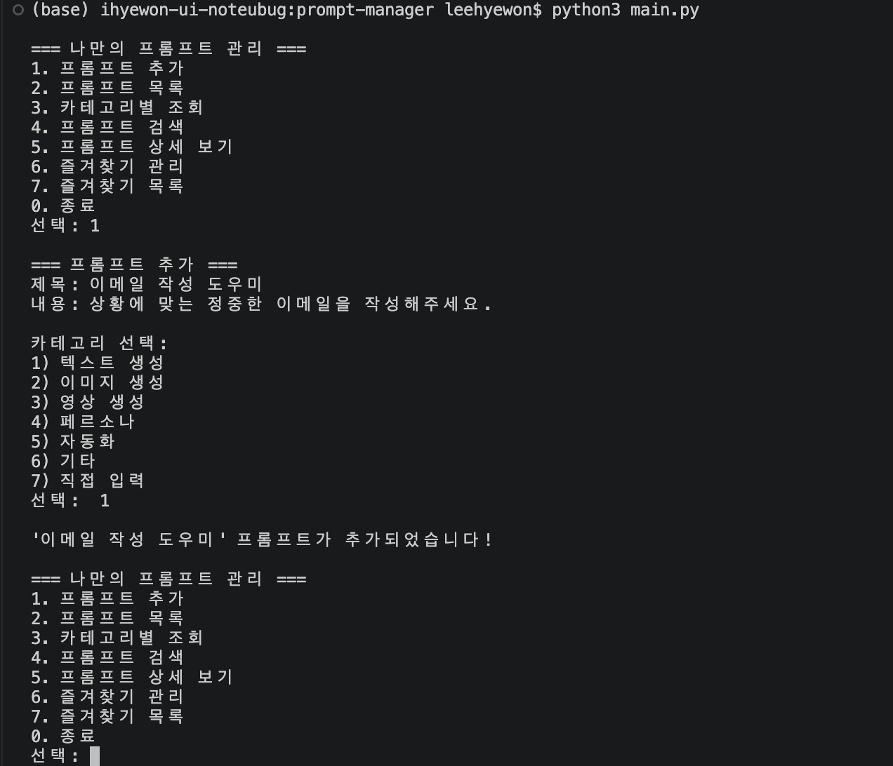
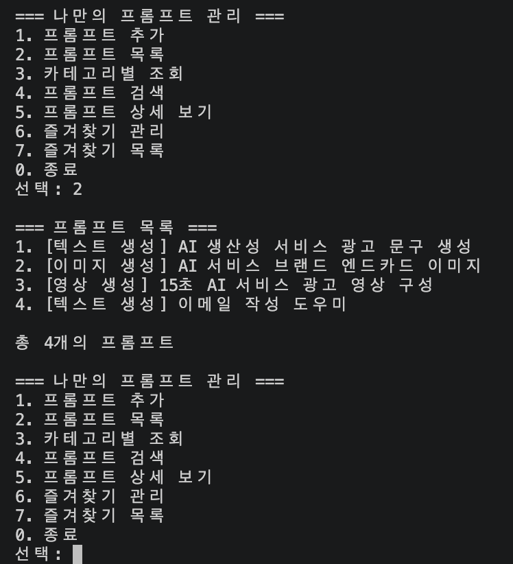
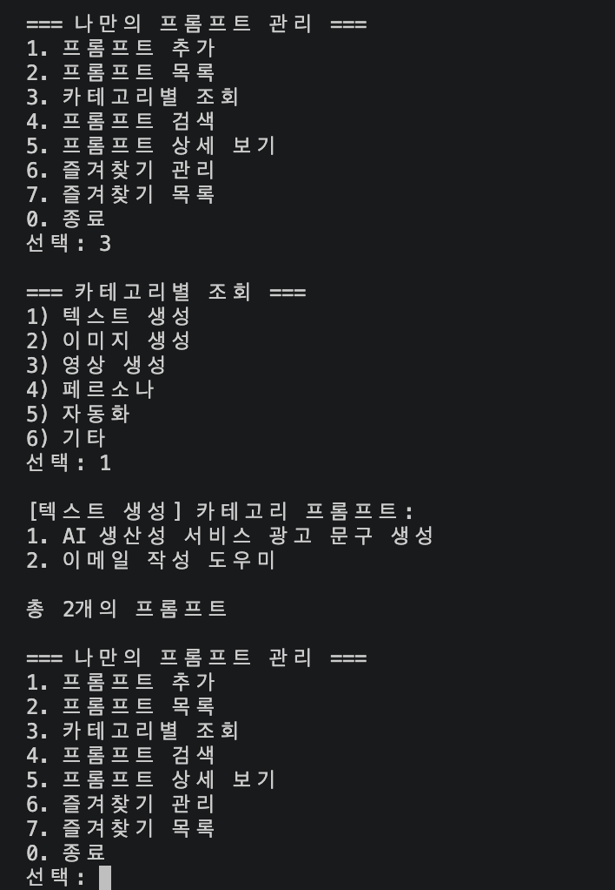
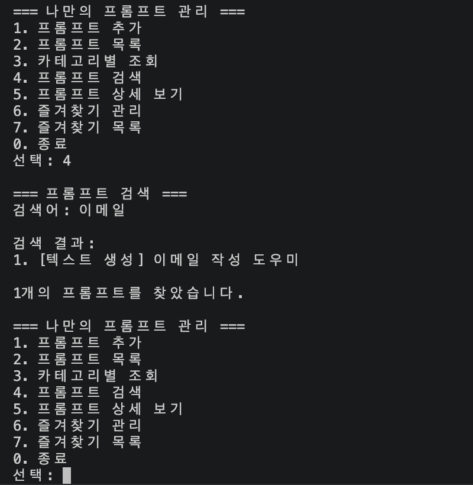
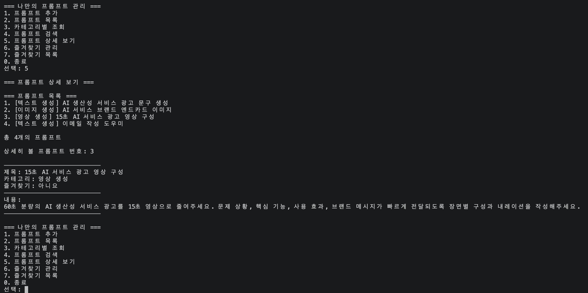
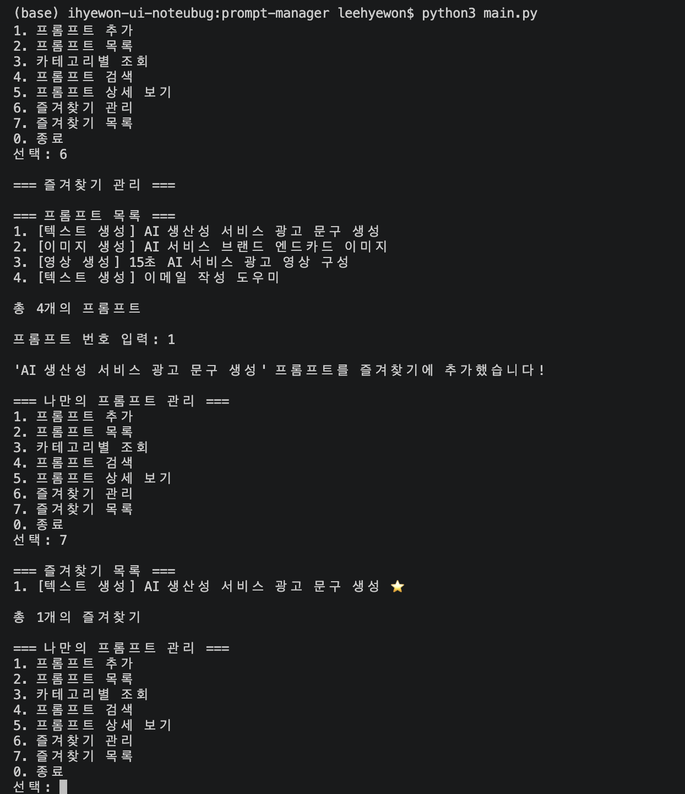
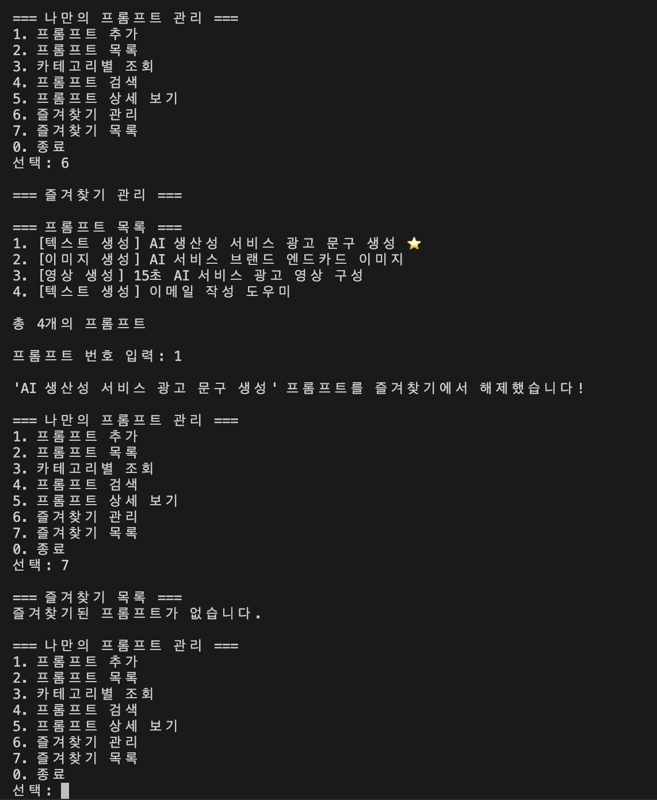

# 나만의 프롬프트 관리 프로그램

생성형 AI 프롬프트를 카테고리별로 등록하고 검색하며, 자주 사용하는 프롬프트를 즐겨찾기로 관리할 수 있는 Python 콘솔 프로그램입니다.

## 프로젝트 소개

텍스트 생성, 이미지 생성, 영상 생성 등 여러 곳에 흩어진 프롬프트를 한 프로그램에서 관리하기 위해 제작했습니다.

사용자는 터미널 메뉴에서 번호를 입력하여 프롬프트를 추가하거나 목록을 확인할 수 있습니다. 제목 또는 내용으로 검색할 수 있으며, 자주 사용하는 프롬프트는 즐겨찾기로 지정할 수 있습니다.

프로그램 실행 중 추가한 프롬프트와 즐겨찾기 상태는 유지되지만, 프로그램을 종료하면 기본 데이터로 초기화됩니다.

## 개발 환경

* Python 3.10 이상
* Visual Studio Code
* Git
* GitHub
* 외부 라이브러리 사용 없음

## 실행 방법

### 1. 저장소 복제

```bash
git clone https://github.com/HyewonLee-hub/codyssey_A1-1.git
```

### 2. 프로젝트 폴더로 이동

```bash
cd codyssey_A1-1
```

### 3. 프로그램 실행

```bash
python3 main.py
```

Windows 환경에서는 다음 명령어를 사용할 수 있습니다.

```bash
python main.py
```

## 주요 기능

### 1. 프롬프트 추가

제목, 내용, 카테고리를 입력하여 새로운 프롬프트를 등록할 수 있습니다.

입력값이 비어 있으면 다시 입력하도록 안내합니다.

### 2. 프롬프트 목록

등록된 모든 프롬프트의 번호, 카테고리, 제목과 즐겨찾기 여부를 확인할 수 있습니다.

### 3. 카테고리별 조회

카테고리를 선택하여 해당 카테고리에 속하는 프롬프트만 조회할 수 있습니다.

### 4. 프롬프트 검색

입력한 검색어가 제목 또는 내용에 포함된 프롬프트를 조회할 수 있습니다.

### 5. 프롬프트 상세 보기

프롬프트 번호를 입력하여 제목, 카테고리, 즐겨찾기 상태와 전체 내용을 확인할 수 있습니다.

### 6. 즐겨찾기 관리

프롬프트 번호를 입력하여 즐겨찾기를 추가하거나 해제할 수 있습니다.

### 7. 즐겨찾기 목록

즐겨찾기로 지정한 프롬프트만 모아서 확인할 수 있습니다.

## 프롬프트 카테고리

* 텍스트 생성
* 이미지 생성
* 영상 생성
* 페르소나
* 자동화
* 기타
* 사용자 직접 입력 카테고리

## 기본 데이터

프로그램 실행 시 이전 미션에서 작성한 프롬프트 3개가 기본 데이터로 등록됩니다.

* AI 생산성 서비스 광고 문구 생성
* AI 서비스 브랜드 엔드카드 이미지
* 15초 AI 서비스 광고 영상 구성

## 데이터 구조

프롬프트 데이터는 리스트와 딕셔너리를 사용하여 관리합니다.

```python
prompts = [
    {
        "title": "프롬프트 제목",
        "content": "프롬프트 내용",
        "category": "텍스트 생성",
        "favorite": False
    }
]
```

## 프로그램 메뉴

```text
=== 나만의 프롬프트 관리 ===
1. 프롬프트 추가
2. 프롬프트 목록
3. 카테고리별 조회
4. 프롬프트 검색
5. 프롬프트 상세 보기
6. 즐겨찾기 관리
7. 즐겨찾기 목록
0. 종료
```

## 프로젝트 구조

```text
codyssey_A1-1/
├── main.py
├── README.md
└── .gitignore
```

## Git 브랜치 작업

프롬프트 목록 기능과 카테고리별 조회 기능을 별도의 브랜치에서 구현한 후 `main` 브랜치에 병합했습니다.

사용한 브랜치 예시:

```text
feature/prompt-list
feature/category-filter
```

## 실행 화면

### 개발 환경

Python과 Git 버전, VSCode 개발 환경을 확인한 화면입니다.



### 메인 메뉴

프로그램 실행 시 제공되는 전체 메뉴 화면입니다.



### 프롬프트 추가

제목, 내용, 카테고리를 입력하여 새로운 프롬프트를 등록할 수 있습니다.



### 프롬프트 목록

등록된 프롬프트의 번호, 카테고리, 제목과 즐겨찾기 여부를 확인할 수 있습니다.



### 카테고리별 조회

선택한 카테고리에 포함된 프롬프트만 조회할 수 있습니다.



### 프롬프트 검색

입력한 키워드가 제목 또는 내용에 포함된 프롬프트를 검색할 수 있습니다.



### 프롬프트 상세 보기

선택한 프롬프트의 제목, 카테고리, 즐겨찾기 여부와 전체 내용을 확인할 수 있습니다.



### 즐겨찾기 추가

선택한 프롬프트를 즐겨찾기에 추가할 수 있습니다.



### 즐겨찾기 해제

즐겨찾기로 등록된 프롬프트를 다시 선택하여 즐겨찾기에서 해제할 수 있습니다.




